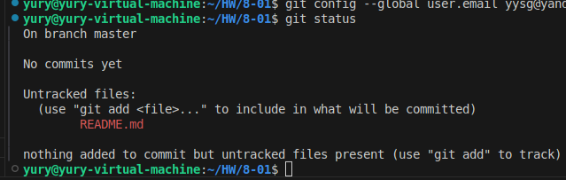
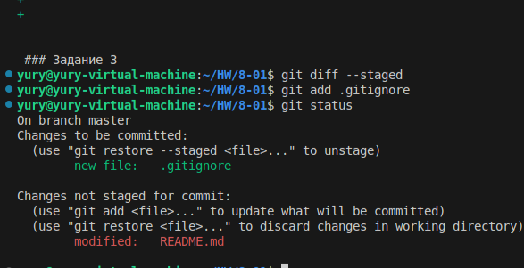
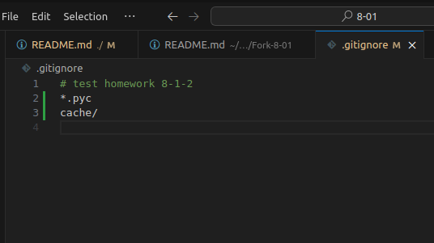
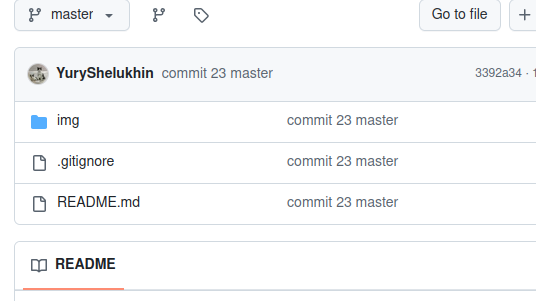
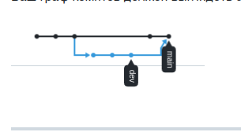

# Домашнее задание к занятию "`Git`" - `Шелухин Юрий`


## Задание 1

**Что нужно сделать:**

1. Зарегистрируйте аккаунт на [GitHub](https://github.com/).
2. Создайте  **новый отдельный публичный репозиторий**. Обязательно поставьте галочку в поле «Initialize this repository with a README».
3. Склонируйте репозиторий, используя https протокол `git clone ...`.
4. Перейдите в каталог с клоном репозитория.
5. Произведите первоначальную настройку Git, указав своё настоящее имя и email: `git config --global user.name` и `git config --global user.email johndoe@example.com`.
6. Выполните команду `git status` и запомните результат.
7. Отредактируйте файл README.md любым удобным способом, переведя файл в состояние Modified.
8. Ещё раз выполните `git status` и продолжайте проверять вывод этой команды после каждого следующего шага.
9. Посмотрите изменения в файле README.md, выполнив команды `git diff` и `git diff --staged`.
10. Переведите файл в состояние staged или, как говорят, добавьте файл в коммит, командой `git add README.md`.
11. Ещё раз выполните команды `git diff` и `git diff --staged`.
12. Теперь можно сделать коммит `git commit -m 'First commit'`.
13. Сделайте `git push origin master`.

В качестве ответа добавьте ссылку на этот коммит в ваш md-файл с решением.

## Решение 1

1-6
cd ~/HW/8-01  
git init  
git config --global user.name YuryShelukhin  
git config --global user.email yysg@yandex.ru


7-11  
добавим отслеживание




Коммит после решения  
[ссылка](https://github.com/YuryShelukhin/8-01HW/commit/5f92d30deaf7c21fae70984601fac4e9f5987925)

---

### Задание 2

1. Создайте файл .gitignore (обратите внимание на точку в начале файла) и проверьте его статус сразу после создания.
2. Добавьте файл .gitignore в следующий коммит git add....
3. Напишите правила в этом файле, чтобы игнорировать любые файлы .pyc, а также все файлы в директории cache.
4. Сделайте коммит и пуш.

## Решение 2

1-2.


3.


4.


Коммит после решения  
[ссылка](https://github.com/YuryShelukhin/8-01HW/commit/9907d3be05a9698f4ef948dd64de2597b55d6bab)

---

### Задание 3


1. Создайте новую ветку dev и переключитесь на неё.
2. Создайте в ветке dev файл test.sh с произвольным содержимым.
3. Сделайте несколько коммитов и пушей в ветку dev, имитируя активную работу над  
    файлом в процессе разработки.
4. Переключитесь на основную ветку.
5. Добавьте файл main.sh в основной ветке с произвольным содержимым, сделайте комит и пуш . Так имитируется продолжение общекомандной разработки в основной ветке во время разработки отдельного функционала в dev ветке.
6. Сделайте мердж dev ветки в основную с помощью git merge dev. Напишите осмысленное сообщение в появившееся окно комита.
7. Сделайте пуш в основной ветке.
8. Не удаляйте ветку dev.

В качестве ответа прикрепите ссылку на граф коммитов https://github.com/ваш-логин/ваш-репозиторий/network в ваш md-файл с решением.

Ваш граф комитов должен выглядеть аналогично скриншоту:



## Решение 3.


### Задание 4

`Приведите ответ в свободной форме........`

1. `Заполните здесь этапы выполнения, если требуется ....`
2. `Заполните здесь этапы выполнения, если требуется ....`
3. `Заполните здесь этапы выполнения, если требуется ....`
4. `Заполните здесь этапы выполнения, если требуется ....`
5. `Заполните здесь этапы выполнения, если требуется ....`
6. 

```
Поле для вставки кода...
....
....
....
....
```

`При необходимости прикрепитe сюда скриншоты
`
